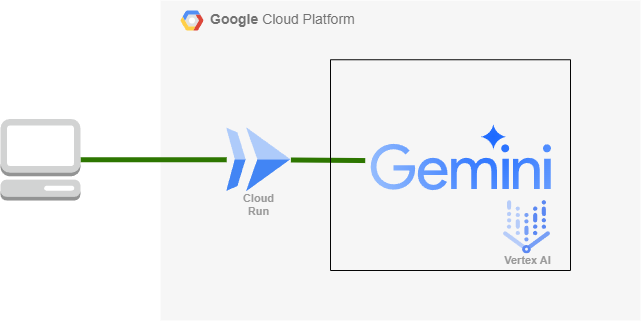

# AI食事アドバイスアプリ「アドバイス」

## はじめに

- 既製品のカロリー解析アプリや食事管理アプリを続けることができなかった、そんな過去の自分へこのアプリケーションを送ります。
- 一緒に開発を行ってくれたチームのみんなへ感謝申し上げます。

---

## 「アドバイス」とは？

- 食事の写真をアップロードするだけで、おおよそのカロリーと食事のアドバイスを提供するAIアプリです。

### 主な機能

- 食事画像のアップロード: ユーザーが食事の写真を撮影し、アップロードできます。
- カロリー推定: GoogleのGemini APIを活用し、写真から料理の種類を推定し、おおよそのカロリーを推測します。
- 食事アドバイス: 推定されたカロリーや食事内容をもとに、栄養バランスのアドバイスを提供します。

### 既存のカロリー計算サービスとの差別化

| 項目            | 既存のカロリー計算アプリ | 「アドバイス」 |
|---------------|----------------|------------|
| カロリー計算の精度 | 高精度（手動入力が必要） | 低精度（手軽さ重視） |
| 入力方法        | 料理名の手動入力、詳細なデータ入力 | 写真をアップロードするだけ |
| 利用対象        | 健康管理にこだわる人、詳細なデータがほしい人 | 大まかにカロリーを知りたい人、手軽に管理したい人 |
| ユースケース    | ダイエット、栄養管理が重要な場面 | 毎日の食事管理を簡単に行いたい |

## ターゲットユーザーと課題

### ターゲットユーザー
- 毎日の食事管理を始めたい初心者の方
- 正確なカロリーと向き合いたくない方
- 詳細なカロリー計算に時間をかけたくない忙しい方
- 栄養バランスについて簡単なアドバイスが欲しい方

### 解決したい課題
- 既存のアプリが複雑すぎて使いこなせない
- 食事記録の入力に時間がかかりすぎる
- 詳細なカロリー計算が面倒で続かない

### 課題へのソリューション
1. 簡単な入力方法
   - 写真を撮るだけの直感的な操作
   - 手動でのデータ入力を最小限に

2. 手軽なカロリー管理
   - 高精度よりも使いやすさを重視
   - おおよその数値で十分な方向け

3. わかりやすいアドバイス
   - AIによる個別化された食事アドバイス
   - 専門的すぎない、実践的なアドバイス

4. シンプルかつ直感的なUI
   - 簡単にいつでも利用できるようにスマートフォンライクな直感的UI

---

## 技術構成

本アプリは、GoogleのAI技術とFirebaseを活用し、スピーディかつスケーラブルな構成を実現しています。

### 使用技術
- フロントエンド: Next.js 15（App Router）
- ホスティング: Cloud Run

### （予定）使用したい技術

- ユーザー認証：Firebase（Google認証）
- データ管理: Firebase Firestore（ユーザーの食事履歴）

### GoogleのAIサービス

| サービス               | 役割                                      |
|----------------------|-----------------------------------------|
| Gemini API in Vertex AI | 画像とプロンプトを組み合わせたカロリー推定 |
| Gemini API in Vertex AI | 食事アドバイスの生成                     |

### Googleのコンピューティングサービス

| サービス    | 役割                   |
|------------|------------------------|
| Cloud Run  | アプリケーションのホスト |

---

## 使い方

1. 食事の写真をアップロード
2. おおよそのカロリーを取得
3. 栄養バランスのアドバイスを受け取る

---

## デモ動画

<iframe width="485" height="862" src="https://www.youtube.com/embed/MHg2L8E7QVQ" title="【AI Agent Hackathon with Google Cloud】提出用動画（アドバイス）" frameborder="0" allow="accelerometer; autoplay; clipboard-write; encrypted-media; gyroscope; picture-in-picture; web-share" referrerpolicy="strict-origin-when-cross-origin" allowfullscreen></iframe>

---

## システム構成図

- - 本アプリケーションは、コンピューティングサービスにCloud Run、AIサービスにVertex AIのGemini APIを使用し、シンプルながら拡張性の高いアーキテクチャを採用しています

---

## 今後の展望

- 今後のアップデートでやっていきたいこと
  - 画像解析をVisionで行うことにより食事の解析精度を向上する
  - アドバイスをボイス化する
  - SNS連携
    - InstagramやXの投稿時に合わせてカロリーが計算できる
    - 食事記録のシェア
  - レシピ提案機能の追加
  - 多言語対応
